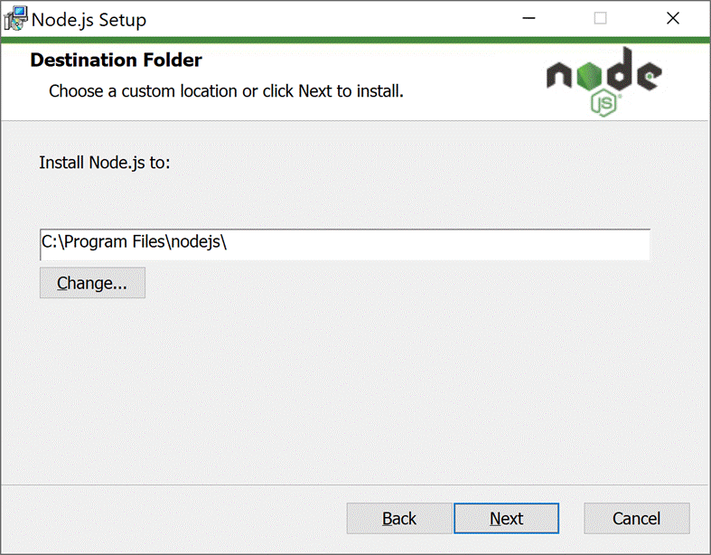
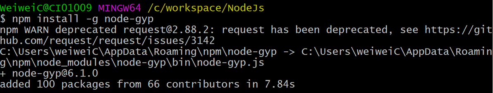
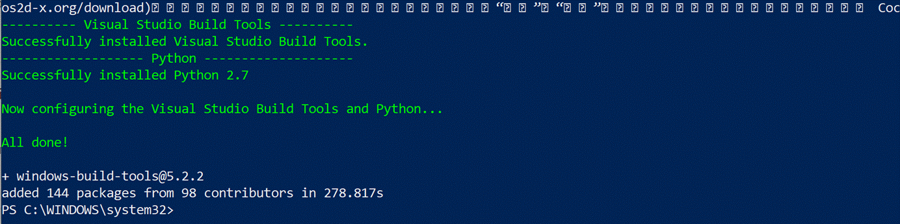
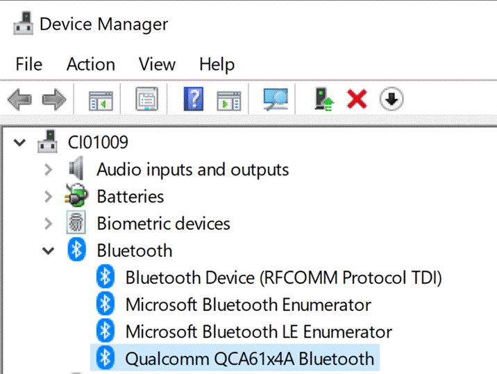
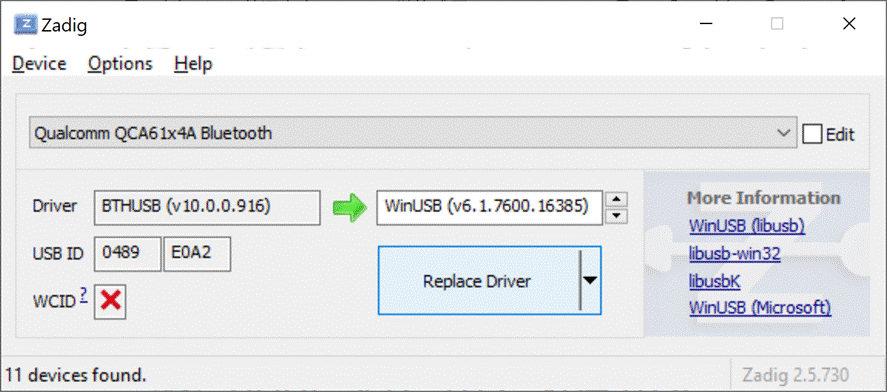
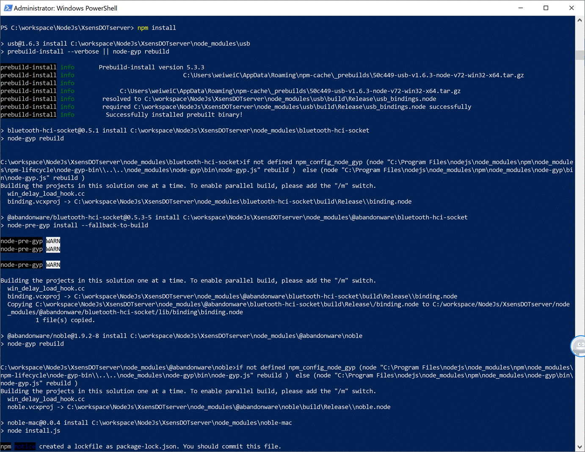
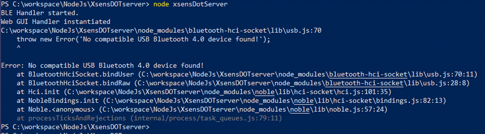
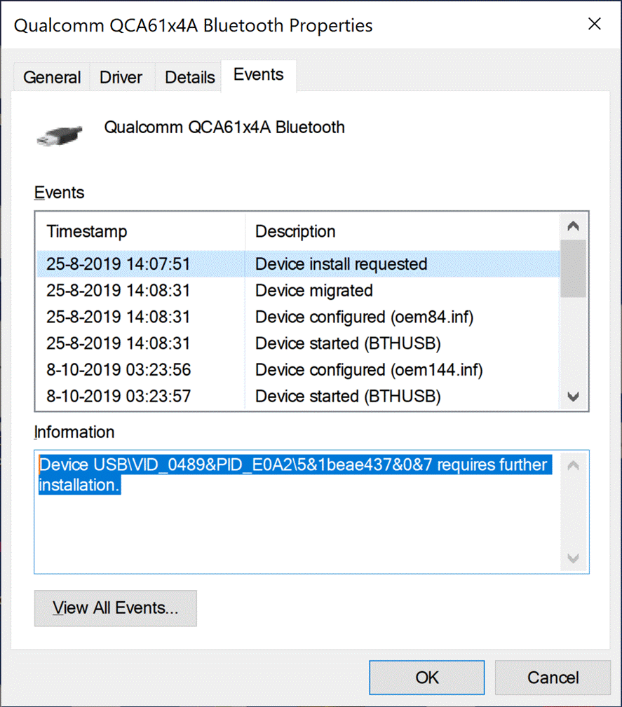

## Xsens DOT Server
A simple web server that can scan, connect and start measurement with Xsens DOT.

## Documentation
* [Installation](#installation)

## Installation
* [Windows](#windows)

### Windows
#### Prerequisites
* Windows 10, 64-bit

#### Install **Node.js** ([node-v12.16.2-x64.msi](https://nodejs.org/download/release/v12.16.2/node-v12.16.2-x64.msi))
1. Keep clicking **Next** to complete the installation.<br>
&nbsp;

2. Enter `npm -v` in command prompt to check if the installation is successful. <br>
&nbsp;

#### Install [node-gyp](https://github.com/nodejs/node-gyp#installation) - Node.js native addon build tool
```sh
npm install -g node-gyp
```


#### Install [noble](https://github.com/abandonware/noble) - A Node.js BLE (Bluetooth Low Energy) central module
Install windows-build-tools from an elevated PowerShell or cmd.exe (**run as Administrator**).
```sh
npm install --global --production windows-build-tools
```


#### Use [Zadig](https://zadig.akeo.ie/) to setup WinUSB driver
1. Find Bluetooth adapter inforamtion in Device Manager <br>
&nbsp;


2. Download and open Zadig, goto **Options**, enable "**List All Devices**"


3. Find your Bluetooth adapter, change the driver to **WinUSB**. Then click **Replace Driver** <br>
&nbsp;

Note: please retry several times if the intallation fails. Or try to restart the computer and try again. 

#### Install dependency package
Enter Xsens DOT Server project and install the dependency package
```sh
npm install
```


#### Run Xsens DOT Server
```sh
node xsensDotServer
```
If this error occurs:
> Error: No compatible USB Bluetooth 4.0 device found!
1. Find the VID and PID of your Bluetooth device<br>
&nbsp;

2. Open source code: *XsensDOTserver\node_modules\bluetooth-hci-socket\lib\usb.js*


3. Add Bluetooth VID & PID in usb.js (line 66)<br>
&nbsp;


4. Run Xsens DOT Server again

#### Open Xsens DOT server in browser
Run http://localhost:8080/ and you should able to use Xsens DOT Server!
